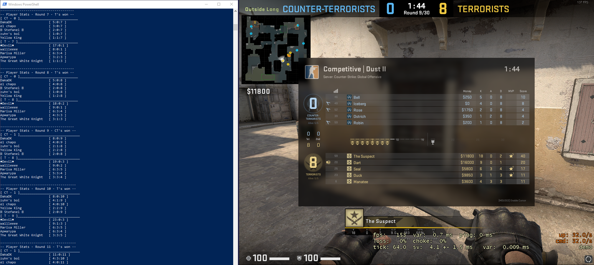
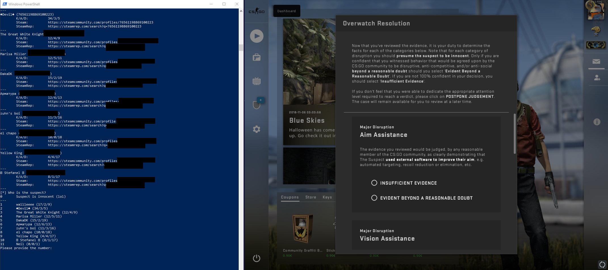

# CS:GO Overwatcher

This tool is a quick hack that allows to investigate the actual suspects of CS:GO Overwatch cases. In the default mode it runs in the background and waits until an Overwatch case will be downloaded. As soon as one clicks the download button, this tool will download and unpack the demo file. After that, it will analyze the demo and prints out the scoreboard of each round as well as a list of all players with their Steam community profile URLs (and some additional info) at the end.



Overview of all Steam profiles after demo is finished:



*Note*: This tool does not interfere with CS:GO in any way. So it should not get you banned. The demo files can be downloaded by everyone that has access to the URL. If you have further questions, you should probably not use this tool.

## Dependencies

`csgo-overwatcher` requires the official [csgo-demoinfo](https://github.com/ValveSoftware/csgo-demoinfo) from Valve. On Linux, the [demoinfogo-linux](https://github.com/kaimallea/demoinfogo-linux) port can be used. However, this has not been tested (yet).

See the [README.md](https://github.com/ValveSoftware/csgo-demoinfo/blob/master/demoinfogo/README.md) for information about how to compile `csgo-demoinfo` on Windows.

### Compiling csgo-demoinfo on Windows

I used Visual Studio 2017 to build `libprotobuf.lib` and `demoinfogo.exe`. However, building [protobuf-2.5.0.zip](https://github.com/google/protobuf/releases/download/v2.5.0/protobuf-2.5.0.zip) some manual patching. The file `src/google/protobuf/io/zero_copy_stream_impl_lite.cc` requires the additional include `#include <algorithm>` and all references to `min()`/`max()` have to be changed to `std::min()`/`std::max()`. After that building Release of libprotobuf should work.

A precompiled version of `demoinfogo.exe` is included in this repository. But it may not work for everyone. I strongly recommend to compiled it for the respective target system!

## Installation

`csgo-overwatcher` requires [Python 3](https://python.org) and some additional modules that can be installed with `pip` via a PowerShell:

```
pip3.exe install -r requirements.txt
```

## Usage

The default mode will just listen on the network and waits until a Overwatch case will be downloaded. After the download, it will automatically parse the demo and print all stats to stdout:

```
python3.exe overwatcher.py
```

The demo files will reside on the file system for later inspection. Already downloaded files can also be parsed as well:

```
python3.exe overwatcher.py 123123_123123123123123123132.dem
```

In case you want to analyse a case that you already started, you can follow these steps:

* Close CS:GO (do not sent your verdict)
* Go to your `csgo` folder (on windows it will be something like `C:\Program Files (x86)\Steam\steamapps\common\Counter-Strike Global Offensive\csgo`)
* Delete the file `myassignedcase.evidence`
* Run `overwatcher.py`
* Start CS:GO and download the Overwatch case again

## Disclamier

The author takes no responsibility for anything this tool will be used for. It has been built for educational purposes. Credits go to the authors of the tools that have been used to create this project.

This code has been written for fun and it will most likely contain bugs.
